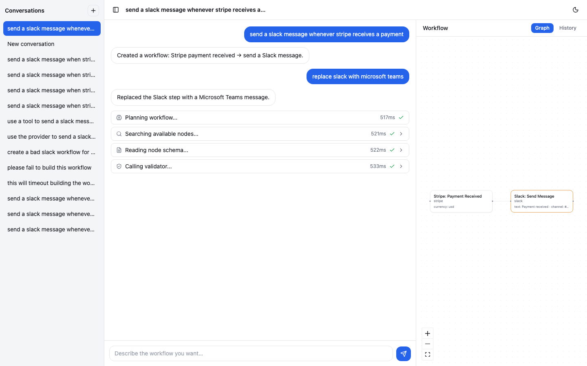
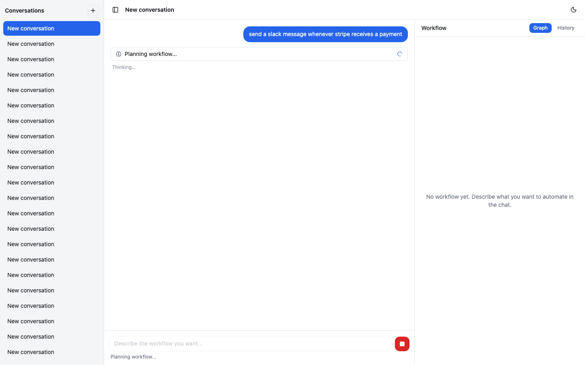
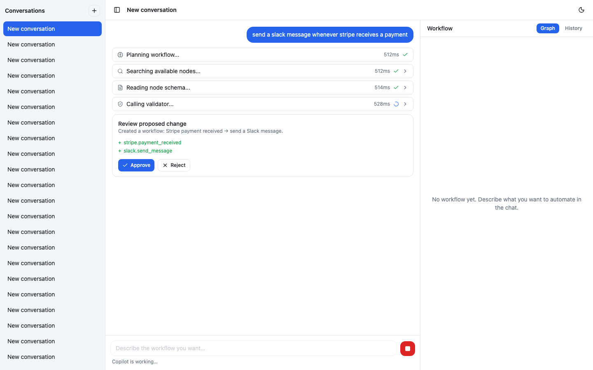
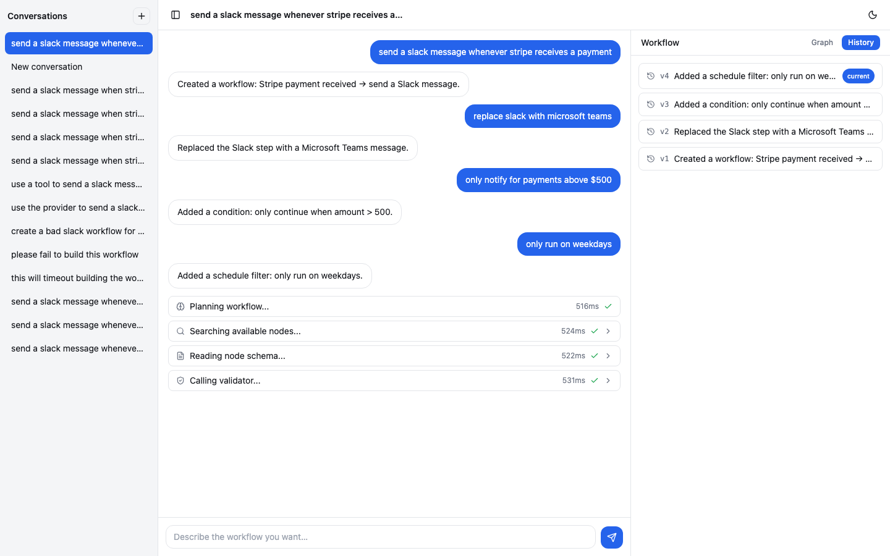
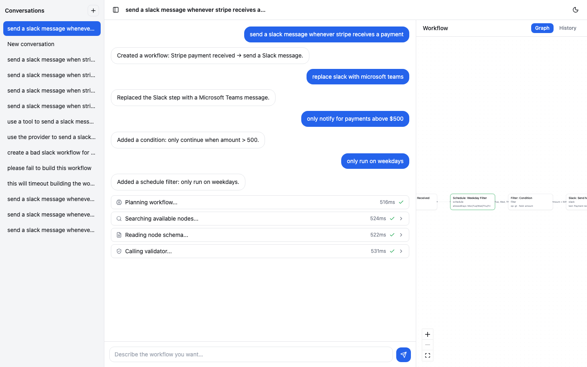
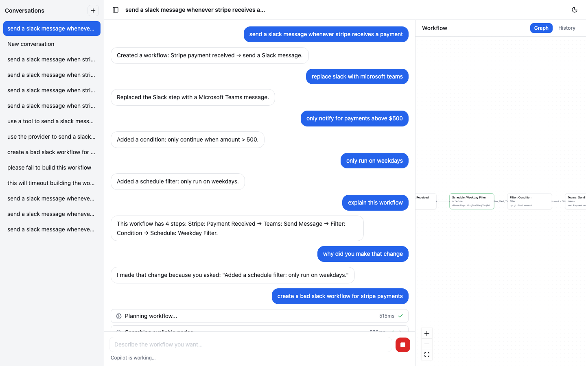
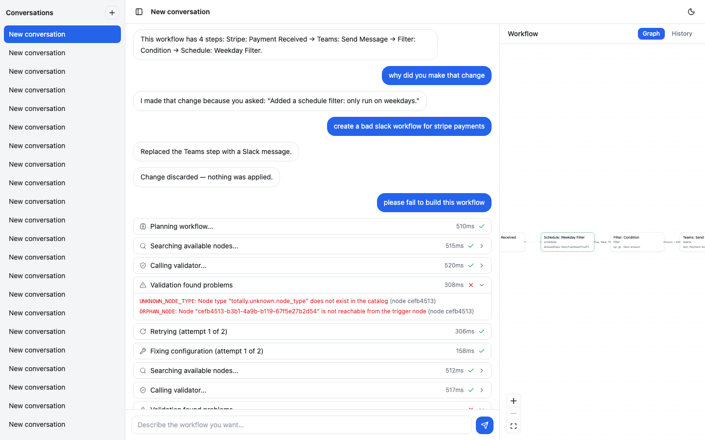

# Zoft AI Workflow Copilot

**A natural-language AI assistant for building Zapier/n8n-style automation workflows.**
Type "send a Slack message whenever Stripe receives a payment" and the Copilot creates,
edits, explains, validates, and repairs workflows through a streaming chat UI — with a
human approval gate between every AI proposal and any actual write.

[](./LICENSE)
[](https://github.com/akash-r34/zoft-ai-workflow-copilot/actions/workflows/ci.yml)


## Overview

A monorepo (pnpm + Turborepo) with a Fastify backend, a Next.js 14 frontend, and a shared
`@zoft/contract` types package. `docker compose up` runs the entire stack — Postgres
(pgvector), Redis, the API, a background worker, and the frontend — from a clean checkout
with **zero API keys**, since the LLM layer defaults to a deterministic, scripted provider
(no cost, no network dependency) with a real circuit breaker/failover architecture ready
for a paid provider to be dropped in later.

## Watch the Demo

[](docs/demo.webm)

*(Click the screenshot above to play `docs/demo.webm` — a full Playwright-recorded
walkthrough: creating a workflow from scratch, edits with diff highlighting, an approval
gate, self-correction/repair, all five failure states, and version history.)*

## The Core Invariant

Every design decision in this repo traces back to one rule:

> **The AI proposes operations. Deterministic code validates and applies them.
> The AI never writes to the database directly.**

1. The agent reasons and calls read-only tools (search nodes, read schema).
2. It emits a typed **operation patch** — never raw SQL or a full graph replacement.
3. A deterministic validator (no LLM) checks catalog membership, JSON Schema config
   validity, DAG structure, trigger rules, and type compatibility.
4. A **human approves or rejects** the validated proposal — only then does the version
   applier write one new immutable `workflow_version` row.

This gives: safety, full version history, an audit trail, and a well-defined recovery
surface for every LLM failure mode. See
[`docs/developer-guide/03-the-core-invariant.md`](docs/developer-guide/03-the-core-invariant.md)
for the deep dive, traced through the actual code.

## Screenshots

<table>
<tr>
<td width="33%"><br><sub>Live activity timeline while the agent reasons</sub></td>
<td width="33%"><br><sub>The approval gate: review a diff before anything is written</sub></td>
<td width="33%"><br><sub>Full, browsable version history</sub></td>
</tr>
<tr>
<td width="33%"><br><sub>The resulting workflow graph (auto-laid-out)</sub></td>
<td width="33%"><br><sub>Self-correction: the agent repairs a failed validation</sub></td>
<td width="33%"><br><sub>Every failure state offers a next action — no dead ends</sub></td>
</tr>
</table>

All 22 captures live in [`test-evidence/screenshots/`](test-evidence/screenshots/).

## Listen: An AI-Generated Podcast Walkthrough

🎧 [**Inside the Zoft AI Deterministic Cage**](https://github.com/akash-r34/zoft-ai-workflow-copilot/releases/download/v1.0.0/Inside_the_Zoft_AI_Deterministic_Cage.m4a)
(~102MB, `.m4a`) — an audio explainer generated by
[NotebookLM](https://notebooklm.google.com) from the developer guide below. Shipped as a
GitHub Release asset rather than a git-tracked file (it's over GitHub's 100MB push limit) —
see the [Releases page](https://github.com/akash-r34/zoft-ai-workflow-copilot/releases) for
this and future assets.

## Quick Start

**Full stack, zero setup** (recommended first run):
```bash
docker compose -f infra/docker-compose.yml up -d --build
# open http://localhost:3000 — no .env file, no API key needed
```

**Local development** (hot-reloading, real backend):
```bash
pnpm install && pnpm --filter @zoft/contract build
docker compose -f infra/docker-compose.yml up -d          # Postgres + Redis only
pnpm --filter @zoft/backend db:migrate && pnpm --filter @zoft/backend db:seed

pnpm --filter @zoft/backend dev                             # terminal 1 — API on :3001
pnpm --filter @zoft/backend worker                           # terminal 2 — background workers
pnpm --filter @zoft/frontend exec next dev -p 3000            # terminal 3 — Next.js on :3000
```
> Use `next dev -p 3000` directly for the frontend here, **not** `pnpm --filter
> @zoft/frontend dev` — that script also boots a bundled mock backend on the same default
> port (3001) the real backend uses. Details in the guide's ops chapter, linked below.

**Frontend only, no backend/database/Redis at all:**
```bash
pnpm install && pnpm --filter @zoft/contract build
pnpm --filter @zoft/frontend dev     # Next.js + a self-contained mock backend, together
```

Full walkthrough, verification steps, and a troubleshooting table:
[`docs/developer-guide/01-getting-started.md`](docs/developer-guide/01-getting-started.md).

## Documentation

| Doc | What it's for |
|---|---|
| [`docs/developer-guide/INDEX.md`](docs/developer-guide/INDEX.md) | **Start here.** A 17-chapter, file:line-cited guide for a developer who's never seen this codebase — product orientation, every subsystem in depth, a full end-to-end request trace, testing, ops, and "how to extend" recipes. |
| [`docs/architecture.md`](docs/architecture.md) | Shorter, outside-reader-facing system design doc — the core invariant and a run's full data flow. |
| [`docs/api.md`](docs/api.md) | REST + SSE endpoint reference, generated from what's actually implemented. |
| [`REMAINING.md`](REMAINING.md) | What's deliberately deferred, and exactly why. |
| [`Zoft_AI_Workflow_Copilot_PRD_v1.1.docx`](Zoft_AI_Workflow_Copilot_PRD_v1.1.docx) ([v1.0](Zoft_AI_Workflow_Copilot_PRD_v1.0.docx)) | The original product requirements doc this build implements — see it for the "why" behind decisions like the mandatory human approval gate and the self-correction budget. v1.1 supersedes v1.0. |

## Tech Stack

Fastify · Prisma + PostgreSQL (`pgvector`) · Redis · BullMQ · Next.js 14 (App Router) ·
React Flow · TanStack Query · Zustand · Tailwind CSS · TypeScript (strict, monorepo via
Turborepo + pnpm workspaces) · Zod · Vitest · Playwright · Docker.

## Project Structure

```
zoft-ai-workflow-copilot/
  apps/
    backend/            Fastify API + AI orchestration + BullMQ workers (Node.js, ESM)
    frontend/            Chat UI + workflow viz (Next.js 14 App Router)
      mock/                An independent second implementation of the same contract
  packages/
    contract/            Shared types, Zod schemas, the SSE event union
  infra/
    docker-compose.yml   Full local stack — Postgres (pgvector) + Redis + backend +
                         worker + frontend, no API keys needed
  docs/
    developer-guide/     17-chapter onboarding guide (see Documentation, above)
    architecture.md       System design + the core invariant
    api.md                REST + SSE reference
    demo.webm             Recorded walkthrough
  test-evidence/          22 screenshots + typecheck/lint/build/test logs
  .github/workflows/ci.yml
```

## Testing and Verification

Four test tiers (pure unit, property-based, DB-gated, DB+Redis-gated integration) — see
[`docs/developer-guide/13-testing.md`](docs/developer-guide/13-testing.md) for what each
covers and how to run it. Captured proof the full stack works end to end lives in
[`test-evidence/`](test-evidence/): 22 Playwright screenshots plus
typecheck/lint/build/test logs.

```bash
pnpm test              # fast tier — no Docker required
pnpm -r typecheck && pnpm -r lint && pnpm -r build
```

## What's Deliberately Not Built

A real `AnthropicProvider` — it needs a paid API key to ever verify, so it's left
unbuilt rather than written-but-unverified. The provider abstraction (`LlmProvider`,
`ProviderRouter`, circuit breaker) is fully built and tested against a deterministic
`MockProvider`; wiring in a real model later is a one-line change with no other code
touched. Full detail, plus a handful of smaller documented scope cuts: [`REMAINING.md`](REMAINING.md).

## License

[MIT](./LICENSE) © 2026 Akash R
